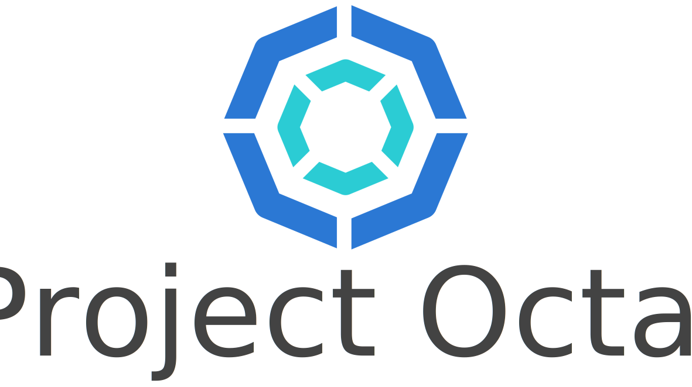

---

This repository contains all the assets and source used to build the https://project-octal.github.io/ page.

### TODO:
- Add sub-pages for each component.
- The header is a little too large?
- Add more documentation on how all the components work together.

---

## Project Colors
**Analogous**
- #2B78D4
- #332BD4
- #2BCCD4

**Monochromatic**
- #2B78D4
- #5593DD

**Tetradic**
- #2B78D4
- #D42B78
- #78D42B