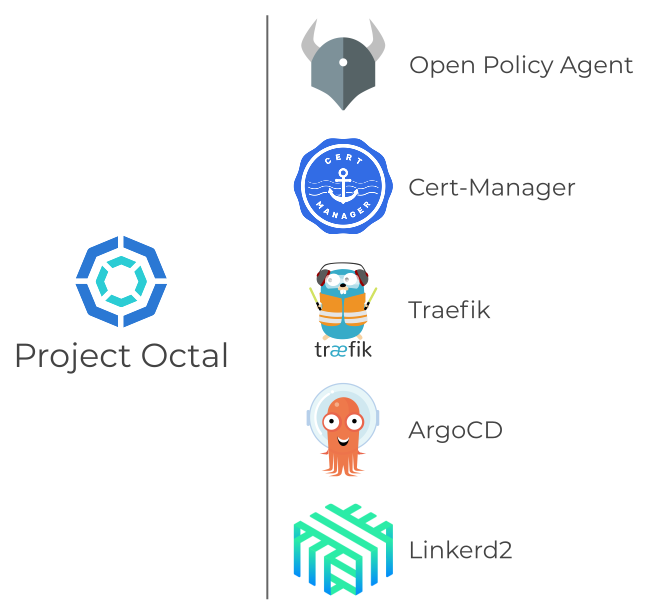

---

## What is Project Octal?
Project Octal is a set of open source projects and configurations collated into a set of Terraform modules aimed at simplifying and standardizing the deployment and operation of Kubernetes clusters in enterprise environments.

## Why Project Octal?
Kubernetes has given rise to a thriving ecosystem of tooling, much of which is open source, and some of which is mature and well documented. The intent of Project Octal is simply to select from this vast ecosystem, mature, well documented tooling ideally with available paid enterprise support that satisfies a specific use-case that can be easily operationalized using Terraform modules.

### Project Octal Component Common Traits
- Deployment and configuration can be done declaratively
- Documentation is thorough and current
- Available paid enterprise support
- Associated with the CNCF in a meaningful way
- Has seen general industry adoption
- The tooling should be licensed under either Apache2.0 or MIT

The most important requirement in the above list is the ability to deploy and manage the tool declaratively. The tool will be packaged as a Terraform module, and that module **must** be capable of managing the tools entire lifecycle. Other items such as "*Has seen general industry adoption*" are much harder to quantify and admittedly subjective. In these cases the decision will rely on experience and research.

## Have questions or suggestions?
Come join the [Project-Octal Discord](https://discord.gg/RyUrTAsa3C) server!

## Core Module Implementation Status

### Current Capability

At this time 3 of the 5 core modules have been implemented. The implemented modules: terraform-kubernetes-argocd, terraform-kubernetes-cert-manager, and terraform-kubernetes-traefik are available via the Terraform public registry.

More information on the implemented core modules can be found here:
- [terraform-kubernetes-argocd](/site-pages/octal-core/argocd.html)
- [terraform-kubernetes-cert-manager](/site-pages/octal-core/cert-manager.html)
- [terraform-kubernetes-traefik](/site-pages/octal-core/traefik.html)

### Planned Capability

The work of implementing the remaining 2 core modules for Linkerd and Open Policy Agent is underway. Once the modules are complete they will be made available via the Terraform public registry.

More information on the planned core modules can be found here:
- [terraform-kubernetes-linkerd](/site-pages/octal-core/linkerd.html)
- [terraform-kubernetes-opa](/site-pages/octal-core/open-policy-agent.html)

